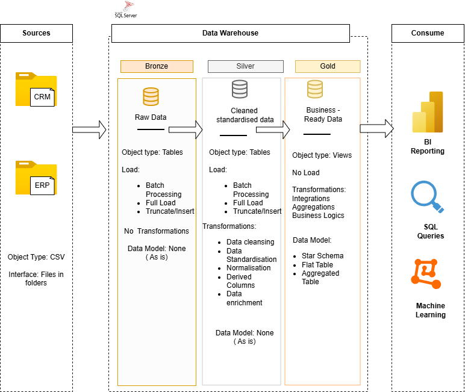

# sql-data-warehouse-project

# 📊 Data Warehouse & Analytics Project

Welcome to the **Data Warehouse & Analytics Project** repository! 🚀

This project demonstrates the end-to-end development of a modern SQL Server data warehouse, from importing and transforming raw data to building a structured analytical model. It showcases data engineering and business intelligence techniques used to generate meaningful insights for decision-making.

---
## 🏗️ Data Architecture

The data architecture for this project follows Medallion Architecture **Bronze**, **Silver**, and **Gold** layers:

1. **Bronze Layer**: Stores raw data as-is from the source systems. Data is ingested from CSV Files into SQL Server Database.
2. **Silver Layer**: This layer includes data cleansing, standardization, and normalization processes to prepare data for analysis.
3. **Gold Layer**: Houses business-ready data modeled into a star schema required for reporting and analytics.

---

# 🚀 Project Overview

## Building the Data Warehouse (Data Engineering)

### Objective
Design and develop a scalable SQL Server data warehouse by integrating data from multiple source systems, ensuring high data quality and creating a reliable foundation for reporting and analytics.

### Key Features
- Import data from multiple source systems (ERP & CRM).
- Clean, validate, and transform raw data.
- Design a Star Schema data model.
- Build fact and dimension tables.
- Develop ETL processes using SQL.
- Document the data model and warehouse architecture.

---

## 📈 Analytics & Reporting (Business Intelligence)

### Objective
Create SQL-based analytical queries and reports to provide actionable business insights and support data-driven decision making.

### Business Insights
- Customer Analysis
- Product Performance
- Sales Trends
- Revenue Analysis
- KPI Reporting

These reports enable stakeholders to monitor business performance, identify trends, and make informed strategic decisions.

---

## 🛠️ Technologies Used

- SQL Server
- T-SQL
- SQL Server Management Studio (SSMS)
- Data Warehousing
- ETL
- Star Schema
- Business Intelligence

---

## 📄 Project Goal

This project demonstrates best practices in **Data Engineering**, **Data Warehousing**, and **SQL Analytics**, providing a complete end-to-end solution suitable for portfolio and learning purposes.
