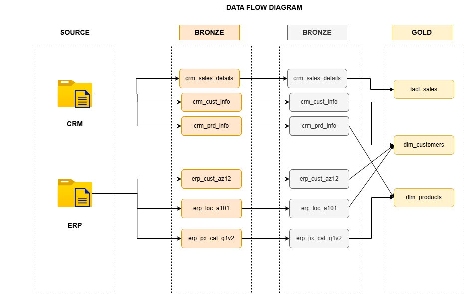
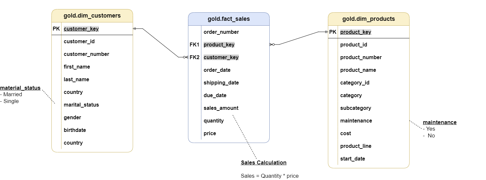

# sql-data-warehouse-project

# 📊 Data Warehouse & Analytics Project

Welcome to the **Data Warehouse & Analytics Project** repository! 🚀

This project demonstrates the end-to-end development of a modern SQL Server data warehouse, from importing and transforming raw data to building a structured analytical model. It showcases data engineering and business intelligence techniques used to generate meaningful insights for decision-making.

---
## 🏗️ Data Architecture

The data architecture for this project follows Medallion Architecture **Bronze**, **Silver**, and **Gold** layers:

1. **Bronze Layer**: Stores raw data as-is from the source systems. Data is ingested from CSV Files into SQL Server Database.
2. **Silver Layer**: This layer includes data cleansing, standardization, and normalization processes to prepare data for analysis.
3. **Gold Layer**: Houses business-ready data modeled into a star schema required for reporting and analytics.

---

# 🚀 Project Overview

## Building the Data Warehouse (Data Engineering)

### Objective
Design and develop a scalable SQL Server data warehouse by integrating data from multiple source systems, ensuring high data quality and creating a reliable foundation for reporting and analytics.

### Key Features
- Import data from multiple source systems (ERP & CRM).
- Clean, validate, and transform raw data.
- Design a Star Schema data model.
- Build fact and dimension tables.
- Develop ETL processes using SQL.
- Document the data model and warehouse architecture.

---

## 🔄 Data Flow

The data flow illustrates how data moves from the **CRM and ERP source systems** through the **Bronze, Silver, and Gold layers** of the data warehouse.

### 🥉 Bronze Layer
Raw data is extracted from the source systems and loaded into the Bronze layer without transformation.

- **CRM Sources:** Customer information, product information, and sales details.
- **ERP Sources:** Customer data, location data, and product category data.
- The original source structure is preserved for traceability and auditing.

### 🥈 Silver Layer
Data from the Bronze layer is cleansed, standardized, and transformed before being used for analytics.

- Data quality issues are identified and resolved.
- Values are standardized and normalized.
- Data from CRM and ERP systems is prepared for integration.
- Business rules and transformations are applied.

### 🥇 Gold Layer
The cleaned Silver layer data is integrated into business-ready datasets designed for reporting and analytics.

- **`fact_sales`** – Contains sales transaction and performance data.
- **`dim_customers`** – Combines customer information from CRM and ERP sources.
- **`dim_products`** – Combines product information from CRM and ERP sources.

The Gold layer forms the final **Star Schema**, providing a structured data model optimized for analytical queries and business intelligence reporting.

---

## ⭐ Data Model

The **Gold Layer** is designed using a **Star Schema** to provide a simple and efficient structure for analytical queries and reporting.

The model consists of one central fact table connected to two dimension tables:

1. **Fact Sales (`gold.fact_sales`)**: Stores transactional sales data including order numbers, order dates, shipping dates, quantities, prices, and sales amounts. It connects to the customer and product dimensions through foreign keys.

2. **Customer Dimension (`gold.dim_customers`)**: Contains descriptive customer information such as customer ID, name, country, marital status, gender, and birthdate. Each customer is uniquely identified using a surrogate `customer_key`.

3. **Product Dimension (`gold.dim_products`)**: Contains product-related information including product name, category, subcategory, product line, cost, and maintenance information. Each product is uniquely identified using a surrogate `product_key`.

### 🔗 Relationships

- `gold.fact_sales.customer_key` → `gold.dim_customers.customer_key`
- `gold.fact_sales.product_key` → `gold.dim_products.product_key`

The dimension tables have a **one-to-many relationship** with the fact table, allowing each customer and product to be associated with multiple sales transactions.

### 🧮 Sales Calculation

Sales values are calculated using:

**Sales Amount = Quantity × Price**

This star schema provides a business-ready data model optimized for **SQL analytics, reporting, and BI applications**.

---

## 📈 Analytics & Reporting (Business Intelligence)

### Objective
Create SQL-based analytical queries and reports to provide actionable business insights and support data-driven decision making.

### Business Insights
- Customer Analysis
- Product Performance
- Sales Trends
- Revenue Analysis
- KPI Reporting

These reports enable stakeholders to monitor business performance, identify trends, and make informed strategic decisions.

---

## 🛠️ Technologies Used

- SQL Server
- T-SQL
- SQL Server Management Studio (SSMS)
- Data Warehousing
- ETL
- Star Schema
- Business Intelligence

